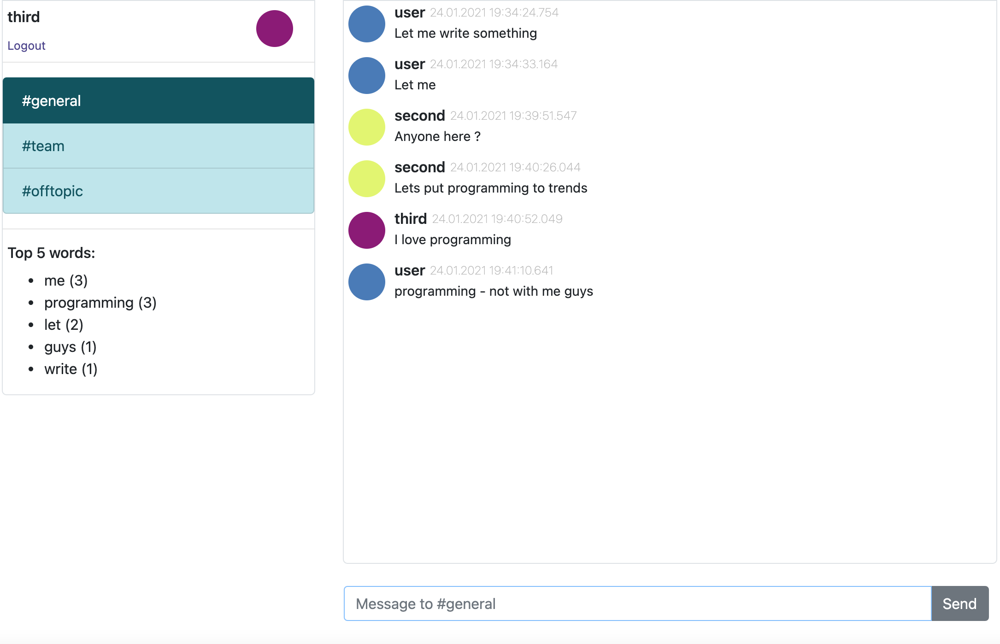

# akka-chat

Pet project for some learning in scope of modern web-technologies.

## Live Demo
Available on GCP here: [web-chat](http://35.242.217.130)  

## Features
* Akka stack for backend (akka-http, akka-streams)
* React.js stack for front
* Notifications via Websockets
* Kafka Streams for stats calculation
* Basic Auth, CORS
* Fully in-memory storage
* Integration/performance tests using Gatling
* Dockerized

### Run on Docker
Zero dependency on jdk/scala/npm required.  
Running-up:  
1. In docker-compose.yaml: substitute *CHAT_SERVER_HOST=localhost* with your Docker ip
2. `docker-compose up`

### Run for local development
See then:  
* [Core](/core/README.md)  
* [Statistics](/stats/README.md)  
* [Frontend](/ui/README.md)  
* [Integration tests](/itest/README.md)  

### Functionality sample

